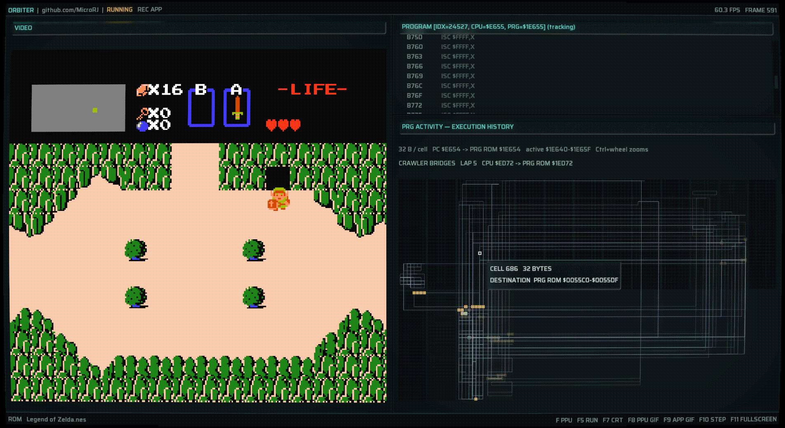
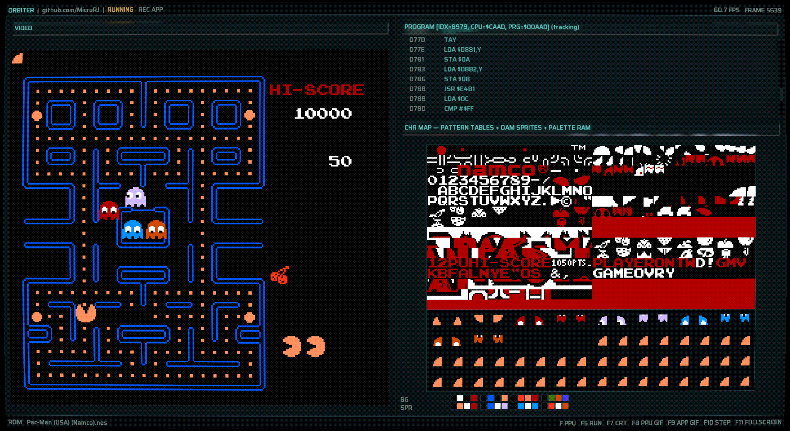

# Orbiter v0.1

Orbiter is an immersive WIP NES introspector / debugger, focused on providing
a bad-ass debugging experience. (Windows Only)

We don't just want to debug the machine, we want to see it breathe,
to hear it's heart beat, to feel its tender pulses ... ... .. .

### In motion






### Supported Mappers:

- Mapper 0: NROM
- Mapper 1: MMC1
- Mapper 2: UxROM
- Mapper 9: MMC2

### Emulator key bindings
- Arrow keys or `WASD`: directional input
- `Z`: A
- `X`: B
- `C`: Start
- `V`: Select

We're still far from my vision, and we've only implemented a few
of the views I want, but those will be added soon.

The emulator and debugger grew together, and so ease of introspection
and simplicity _are_ the main priorities.

Additional captures are available in [`gifs/`](gifs/).

### Road map
- Continue improving the architecture and performance
- Support user driven customization
- Add the missing views, APU/PPU/Memory
- Add immersive program graph view
- Add a better breakpoint detection system
- Add read/write breakpoints
- Snapshot compression for rewinds, infinite rewind
- Multi-threading / compression thread / GPU sync thread
- Cycle accurate emulator with perfect test coverage

### Building
From the x64 developer command prompt run ```build.bat```
